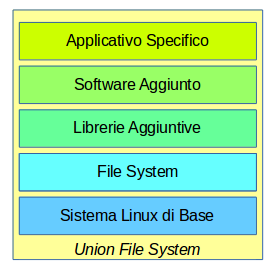

# Macchine Virtuali e Contenitori

E' fondamentale comprendere la differenza tra macchine virtuali e contenitori, e come questi ultimi vengono implementati su diverse piattaforme.

## Macchine Virtuali

Le macchine virtuali emulano lo hardware ed il sistema operativo che vi interagisce.

Le macchine virtuali possono essere basate su svariati **Sistemi Host**, diversi **Virtualizzatori** e avere diversi **Sistemi Operativi Ospitati**.

Hanno **vantaggi**:

* sono disponibili immagini di più sistemi diversi
* hanno un notevole grado di flessibilità di configurazione
* sono una tecnologia matura

D'altronde hanno anche alcuni **svantaggi**:

* richiedono risorse considerevoli
* l'installazione, configurazione e manutenzione richiede tempo

## Contenitori

I contenitori sono una virtualizzazione dell'_ambiente operativo software_ necessario alle applicazioni, non dell'_hardware_. Le macchine virtuali, al contrario, sono una virtualizzazione dell'hardware.

L'implementazione dei _Contenitori_ su Linux è come illustrato di seguito.

I **vantaggi** sono:

* più efficienza e minore necessità di risorse
* meno manutenzione di sistema
* deployment più veloce

Gli **svantaggi**:

* tecnologia non completamente stabile
    * occorre prevedere il cambiamento
* tempo di preparazione delle immagini

In teoria la tecnologia dei _contenitori_ può essere implementata su diversi sistemi operativi ospitanti.

Per esempio ne esisteva una versione nativa per **Solaris 10/11**.

Volendo ne può venire sviluppata una versione nativa per Windows, prevista in futuro.

Non è al momento prevista una tecnologia di contenitori per Mac.

**Docker** è una implementazione nativa di Linux e richiede il Kernel Linux.

## Immagini

Un contenitore è l'istanza run-time di un'immagine.

Un'immagine è la combinazione di un certo numero, variabile a seconda della specifica immagine, di strati software (_Layers_), integrati all'interno di uno **Union File System**.

Lo strato di base contiene le utilities e librerie fondamentali del sistema operativo di base, ma _non il Kernel_. Con _Docker_, questo deve essere Linux.

Tutte le immagini vedono i servizi di base dello stesso Kernel sottostante, per esempio i _device drivers_.

I contenitori si chiamano così perche _copiano_ e _privatizzano_ un numero parziale di features (_spazi nomi_) del kernel sottostante, ma non tutte.
