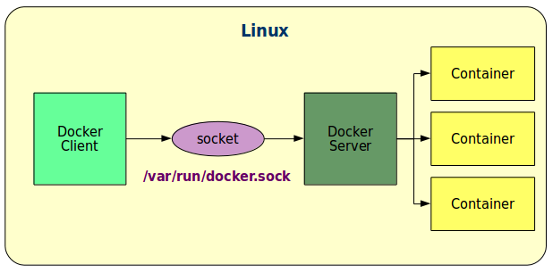

# Architettura

Docker è basato su un'architettura Client-Server:
* `docker` - client, invia comandi e richieste al server
* `dockerd` - server, gestisce i contenitori e le immagini

Solitamente client e server si trovano sulla stessa macchina HW:
* il server è responsabile dei propri contenitori locali e il client è il _suo_ client - il collegamento dell'utente al client avviene tramite `ssh`
    * tutto quello che è necessario è che l'utente che dà i comandi client sia configurato nel gruppo `docker`
* i messaggi tra client e server sono in chiaro e non esiste (ancora) un vero strato software di autenticazione tra loro

Il collegamento tra client e server su un'unica macchina avviene tramite un _socket Unix_: `/var/run/docker.sock`.

E' possibile anche configurare Docker per usare dei _socket Inet_, in modo da avere il client e il server su macchine diverse, ma si introducono naturalmente alcuni problemi di sicurezza.

La soluzione raccomandata in fase di primo apprendimento è:
* client e server sulla stessa macchina
* accesso alla macchina tramite `ssh`
