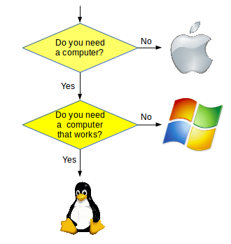
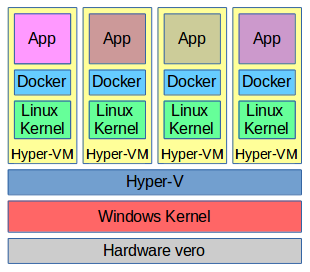
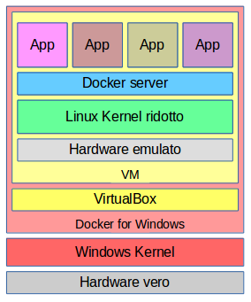
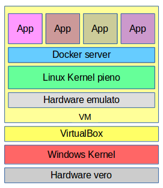
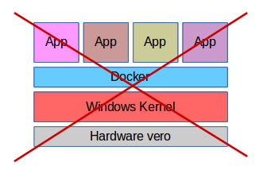
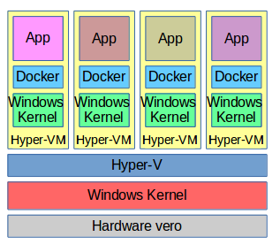

# Docker su Windows

Chi intenda installare Docker su Windows come ambiente di produzione, non ha fondamentalmente capito che:

* Docker necessita di un kernel Linux
* in generale l'architettura corrente di Windows è in _ritardo tecnologico_, e il suo uso è una remora all'innovazione

La Microsoft ha promesso una ventura versione di Windows col supporto a **cgroups** e **UnionFS** che dovrebbe implementare i containers su Windows in modo nativo. Ma non sarà il prodotto _Docker_.

Nel loro vedere (finalmente) la luce, forse la Microsoft coglierà l'occasione per ovviare ad altre numerose pecche che affliggono i loro sistemi.

Non è che tutto il software Microsoft sia scadente. Alcuni prodotti, quali **Visual Studio** (in particolare _Visual Studio Code_ che è Open Source), sono ottimi. [E anche il mitico _Flight Simulator_]. Sono i sistemi operativi il problema.

E' opinione del presente autore che qualsiasi ditta può effettuare una immediata _miglioria di qualità_ abbandonando i sistemi Microsoft e passando a Linux. E' 25 anni che il presente autore ha questa opinione, e innumerevoli prove.

Installare Docker su Windows può al limite servire solo ad apprendere i comandi di base di Docker.



---

## Ambienti e Versioni

Docker CE può venire installato:

---

1. in versione corrente su un Windows 10 Professional a 64 bit che abbia **Hyper-V** disponibile
* Questo installa una macchina virtuale Linux utilizzando lo _hypervisor_ netivo e più efficiente
* La macchina virtuale Linux installata non è un sistema operativo completo
* Questa soluzione non è disponibile per _Mac_
* L'efficienza di questa soluzione è piuttosto limitata

L'installazione è dal sito: `https://store.docker.com/editions/community/docker-ce-desktop-windows`

Architettonicamente si ottiene la seguente situazione.



Come si vede è una soluzione piuttosto bizantina.

---

2. in versione _legacy_ su un Windows precedente (minimo Windows 7) o non dotato di _Hyper-V_, ma sempre a 64 bit
* Questo installa **Docker Toolbox**, alcuni componenti assortiti di Docker che girano su una macchina virtuale Linux utilizzando il virtualizzatore software **VirtualBox** della Oracle
* Non è utilizzabile il software di virtualizzazione **VMWare**
* La macchina virtuale Linux installata non è un sistema Linux completo
* Questa soluzione è disponibile anche per _Mac_
* L'efficienza di questa soluzione è molto limitata

L'installazione è dal sito: `https://github.com/docker/toolbox/releases`

Architettonicamente si ottiene la seguente situazione.



La macchina virtuale è scaricata dalla rete durante l'installazione. Si tratta dell'immagine ISO `boot2docker.iso`, che ha limitazioni:
* utilities Linux molto ridotte
* si accede ad una shell Linux
    * o direttamente dalla macchina virtuale
    * o da una utility parte del Toolbox
* non si può accedere da una Powershell di Windows

---

3. installando una macchina virtuale Linux da zero sul software di virtualizzazione **VirtualBox** della Oracle, in versione recente e con relative estensioni (non VMWare)
* Il Linux installato deve essere Ubuntu 16.04 LTS
* Si può quindi procedere a installare Docker come per normale installazione Linux
* L'efficienza e le risorse di questa installazione dipendono, attenzione, non da Linux, ma dal software _VirtualBox_ e ultimamente dal Windows sottostante, quindi sono piuttosto limitate

Architettonicamente si ottiene la seguente situazione.



E' semplicemente una macchina virtuale con un sistema Linux completo. Come tali ha tutte le utilities che abbiamo installato, incluso una buona shell, e tutti gli ambienti ausiliari di Docker, come _Swarm_, che in Windows non esistono.

---

## Container Windows

Recentissime versioni di Windows supportano una versione _nativa_ dei containers, ma non con la stessa architettura di Linux.

Occorre Windows 10 Anniversary Edition oppure Creators Update. La versione minima deve essere `14393.222`. I livelli di licenza devono essere Professional o Enterprise. L'attivazione di _Hyper-V_ rimane obbligatoria.

Dopo l'installazione di _Docker for Windows_, eseguita come al punto 1. sopra, attivare il menù di configurazione ed effettuare la scelta:
```
Switch to Windows containers ...
```

Attenzione, non si ottiene la seguente architettura.



Ma si ottiene invece la seguente.



Come si vede è cambiato poco dalla versione di installazione **1.**, se non forse una maggiore efficienza.

Un vantaggio è che si può accedere ai comandi Docker da una Powershell di Windows.
