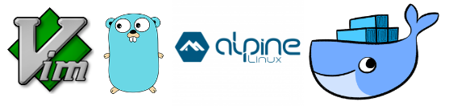

# Esercizio: Vim editor per Go



Vogliamo un ambiente di sviluppo per il linguaggio Go in un'immagine, incluso un editor `vim` con un plugin che supporti il Go. Chiameremo questa immagine **vimgo**.

## Creazione di vimgo

Partiamo con un container con Linux Alpine:
#### `docker run -ti --name alpine alpine sh`

Se l'immagine _alpine_ non è mai stata acquisita prima, Docker si connette al Docker Hub e la scarica.

In seguito lancia il contenitore e ci troviamo quindi in una shell di questo contenitore, corrispondente al PID 1.

Compieremo da qui una serie di attività:

1. Aggiunta di Vim

* L'utility _alpine_ per la gestione dei pacchetti software è `apk`.
In Alpine, acquisiamo tutti i packages e installiamo `vim`:
```bash
apk update
apk add vim
```
* Avremo bisogno anche di `git`:
```bash
apk add git
```
* Ora installiamo il plugin per `go` da GitHub:
```
cd
git clone https://github.com/fatih/vim-go.git \
~/.vim/pack/plugins/start/vim-go
```

2. Installazione di Go

* Installiamo quindi `go`:
```bash
apk add go
apk add musl-dev
```
* Ci può volere un po' di tempo
	* **Spiegazione**: Alpine Linux non usa `Glibc` come Ubuntu o Red Hat, ma `musl`, una nuova libreria standard del linguaggio C. Per poter compilare dal `go` è necessario installare il pacchetto di sviluppo di musl.

* Prepariamo ora le directories di cui **Go** ha bisogno, il cosiddetto _scaffolding_:
```bash
su -
mkdir -p ~/go/src ~/go/bin ~/go/pkg
```
* Il motivo per cui diamo il comando `su -` è che la nostra shell originaria non è una shell di login, ma semplicemente una shell qualsiasi, associata col PID 1 del contenitore, e nella directory `/`. Noi vogliamo ottenere invece l'ambiente completo dell'utente _root_, incluso la sua Home Directory.

3. Aggiunta del plugin di `vim` per `go`:
* Lanciamo semplicemente `vim` e diamo il comando:
```
:GoInstallBinaries
```
* Può impiegare un po' di tempo
* Il plugin di vim che abbiamo installato permette anche dal suo interno di acquisire numerose utilities di sviluppo di Go. 
* Tutte le principali utilities di Go vengono scaricate dalla rete ed installate nella corretta struttura di sviluppo: `/root/go`: **gogetdoc**, **guru**, **golint**, **fillstruct**, **godef**, **motion**, **errcheck**, **gocode**, **gotags**, **impl**, **goimports**, **gomodifytags**, **keyify**, **gorename**, **asmfmt**, **gometalinter**
	* Questo è un insieme completo di utilities, integrate in `vim`, che praticamente rendono tale editor un _Integrated Development Environment_ per il linguaggio Go.
* Usciamo del `vim` col normale comando `:x`

* Per visualizzare la struttura creata possiamo installare anche l'utility _tree_: `apk add tree`
e dare il comando `tree /root/go`. E' pderosa.

4. Prova di `vim` con programma `go`
* Proviamo `vim`:
```bash
cd /tmp
vim hello.go
```
* La ragione per cui proviamo un programma Go in una directory temporanea e non nel suo _scaffolding_, è che non abbiamo ancora impostato le variabili d'ambiente giuste per usare lo _scaffolding_.
* Nel file `hello.go` inseriamo il codice seguente:
```go
package main

import "fmt"

func main() {
	fmt.Println("Hello from vim-go")
}
```
* Notare che `vim` mi ha già offerto un templato d'inizio del programma in Go.
* Possiamo testarlo localmente con `go run hello.go`
```
Hello from vim-go
```

5. Configurazione dell'ambiente
* Ora occorre modificare le variabili d'ambiente corrette per lo sviluppo, editando il file `/root/.profile`.
```bash
export GOROOT=/usr/lib/go
export GOPATH=~/root/go
export GOBIN=$GOPATH/bin
export PATH=~/bin:$GOBIN:$GOROOT/bin:$PATH
```

Ora il momento delicato.

**!!** Uscire dal contenitore con `Ctrl-P Ctrl-Q`, NON col comando _exit_.

---

Siamo nella macchina ospite, e il contenitore è chiuso.

Generiamo la nuova immagine:
#### `docker commit alpine vimgo`

Ci può volere qualche istante mentre viene preparata la nuova immagine. Verifichiamone poi l'esistenza con `docker images`.

Notare che mentre l'immagine **alpine** di base occupa solo 3.97 MB, la nuova immagine **vim-go** occupa ben 508 MB, poichè vi abbiamo installato molte utilities.

Fermiamo e rimuoviamo il vecchio contenitore
```bash
docker stop alpine
docker rm alpine
```

Creiamo anche una directory `~/bin` ove ospitare eseguibili, e che sarà il volume condiviso al nostro sistema host:
```bash
mkdir ~/bin
```

## Uso di vimgo

Lanciamo il nuovo contenitore:
#### `docker run --rm -ti --name vimgo -v ~/bin:/root/go/bin vimgo su -`

Il comando eseguito `su -` lancia una shell di login di root, che dal `.profile` setta tutte le variabili d'ambiente. E' la shell di default di `root` su Alpine (come descritto da `/etc/passwd`).
E' necessario eseguire `su -` perchè se si esegue semplicemente `sh` parte una shell senza ambiente.

Notare che la directory locale `~/bin`, cioè la sottodirectory `bin` della Home Directory, è mappata alla directory `/root/go/bin` del contenitore. Questa è configurata come la directory in cui sono compilati i programmi **Go**.

Il contenitore verrà rimosso automaticamente all'uscita da questa shell, vista l'opzione `--rm`.

Andiamo nella directory giusta e generiamo un file di prova:
```
cd go/src
mkdir hello
cd hello
vim hello.go
```
In questo file inseriamo il seguente codice, poi salviamo ed usciamo.
```go
package main

import "fmt"

func main() {
	fmt.Println("vim-go")
}
```
Ora è necessario compilare il programma.

Attenzione alla compilazione. Se usiamo il semplice comando:
```
go build hello.go
```
l'eseguibile è compilato dinamicamente e per la libreria runtime `musl`. Non funzionerà in Ubuntu o qualsiasi altro Linux basato su Glibc.

Alpine però aveva installato anche il toolchain GCC, quindi possiamo costruire il programma eseguibile col link esterno:
```
go build --buildmode=exe --ldflags '-linkmode external -extldflags "-static" -s' hello.go
```
L'ulteriore opzione `-s` toglie all'eseguibile la tabella dei simboli e il supporto al debugging, riducendone così la dimensione.

Viene generato l'eseguibile `hello`. Copiamolo nel volume condiviso:
```
cp hello ~/bin
```
Ora possiamo uscire dal contenitore:
```
exit
```
Nella nostra directory `~/bin` c'è il file `hello`, linkato staticamente, quindi eseguibile.

Abbiamo ottenuto un ambiente di sviluppo in linguaggio Go completamente incapsulato in un contenitore.

Attenzione che il file `hello` generato nella nostra directory `~/bin` appartiene all'utente `root`.
