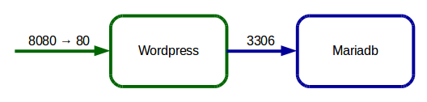

# Compose con Due Containers



* Cercare **wordpress** su `hub.docker.com`
* Verificare l'uso di questa immagine e le variabili d'ambiente richieste
* Nei dettagli c'è anche una sezione su docker-compose e un esempio di file di configurazione
  * Verificare che sia di versione 2
* Copia e incolla in una directory di lavoro

```
mkdir -p ~/ex/compose/wp1
cd ~/ex/compose/wp1
vi docker-compose.yml
```

```yml
version: '2'

services:

  wordpress:
    image: wordpress
    ports:
      - 8080:80
    environment:
      WORDPRESS_DB_PASSWORD: example

  mysql:
    image: mariadb
    environment:
      MYSQL_ROOT_PASSWORD: example

```

Generazione immagini e lancio containers:
#### `docker-compose up -d`

Può impiegare molto tempo a scaricare le immagini e dipendenze

Notare che crea automaticamente una rete di interconnessione tra i container.

Verifica:
#### `docker ps`
#### `docker network list`

Collegarsi con un browser a localhost:8080.

## Il Comando `docker-compose`

Sintassi:
#### `docker-compose [-f <arg>...] [options] [COMMAND] [ARGS...]`

Aiuto:
* Globale: `docker-compose help`
* Specifico: `docker-compose help` _comando_

Comandi principali: `docker-compose …`
* **stop**
* **start**
* **restart**
* **pause**
* **unpause**
* **ps** – lista i contenitori
* **logs** – lungo output dei log dei servizi

