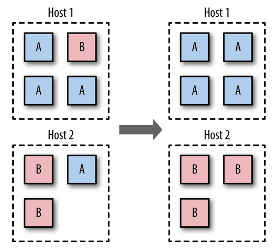

## Sicurezza in Profondità

Adottare tutta una serie di misure, nessuna delle quali è sufficiente, ma che in aggregato aumentano la sicurezza.

### Minimo Privilegio

Ogni container deve possedere i privilegi minimi per il suo lavoro e non di più.
Un container compromesso non deve essere in grado di compiere danni eccessivi.

La difesa consiste in:
* assicurarsi che i processi nei contenitori non siano attivi come `root`
* mappare i filesystems host come `read-only` se non vi è necessità di scrittura
* ridurre le _system calls_ che un contenitore può eseguire
* limitare le risorse host che un contenitore può usare

#### Utenti del gruppo `docker`

Solo i membri del gruppo `docker` possono gestire le immagini e contenitori.

Possono diventare membri del gruppo `docker` solo utenti di sistema che abbiano già privilegi amministrativi, poichè chiunque lanci un contenitore è in grado di ottenerli.

Considerare il comando:
```
docker run -v /:/homeroot -it debian bash
```
Il processo `bash` del contenitore ha idiritti di `root` nel contenitore, ma anche sul sistema host se riesce ad uscirne.
Il mappaggio `-v /:/homeroot` fa sì che modifiche alla cartella `/homeroot` del contenitore corrispondano a modifiche di `/` del sistems hodt.

### Segregazione du Host Diversi

Configurare pià host diversi,se possibile, in modo che uno host contenga contenitori appartenenti allo stesso utente.



Questo diminuisce l'efficienza ma aumenta la sicurezza.

Altra possibilità è disegregare su host diversi i contenitori che gestiscono informazioni con livello di sensitività diversi.

### Contenitori in Macchine Virtuali

Questo aggiunge uno strato di sicurezza, ma va in controtendenza alla filosofia dei contenitori.

Uncontenitore che conduca un attacco di diniego di servizio può riuscire al massimo a consumare tutte le risorse della VM, non del sistema host, di altri contenitori sul sistema host o di altri contenitori in altre VM.

E' una soluzione da adottarsi solo in caso di sospetto su un contenitore particolare, non di prammatica.

