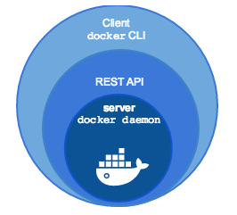

### Docker Machine

Permette di compiere le seguenti operazioni:
* installazione di Docker su una macchina Windows o Mac, in locale
* installazione e gestione di Docker so più sistemi virtuali Linux remoti

Docker Machine è disponibile anche per Linux, ma dato che controlla sistemi virtuali Linux, abbiamo la situazione di presenza di macchine virtuali, che è quello che Docker preferisce evitare. E' raro che si installi Docker Machine su Linux.

#### Differenze tra **Docker Engine** e **Docker Machine**

Docker Engine è il server Docker, che esegue i comandi del client e fornisce una API RESTful.



Docker Machine è uno strumento per creare e controllare istanze Docker Engine su uno o più sistemi virtuali Linux, locali o remoti.


### Installazione di Docker Machine su Linux

```
curl -L https://github.com/docker/machine/releases/download/v0.10.0/docker-machine-`uname -s`-`uname -m` >/tmp/docker-machine &&
  chmod +x /tmp/docker-machine &&
  sudo cp /tmp/docker-machine /usr/local/bin/docker-machine
```

Testare con: `docker-machine version`.

Si può anche installare in un modo molto simile su Windows se si sta usando **Git Bash**:
```
if [[ ! -d "$HOME/bin" ]]; then mkdir -p "$HOME/bin"; fi && \
  curl -L https://github.com/docker/machine/releases/download/v0.10.0/docker-machine-Windows-x86_64.exe > "$HOME/bin/docker-machine.exe" && \
  chmod +x "$HOME/bin/docker-machine.exe"
```
Ed è opportuno modificare la variabile d'ambiente **path** di Windows per vedere anche la directory `$HOME/bin`.

**Incidentalmente**: Git Bash è uno strumento fortemente raccomandato per chi lavora in Windows. Fornisce una shell Bash interattive e programmabile, l'editor `vi`, molte utilities Linux e i comandi `Git`.
E' reperibile a: `https://git-scm.com/download/win`.

### Installazione di Docker Machine da immagine precompilata

Gli utenti Windows o Mac possono preferire questa soluzione e trovarla su:
`https://github.com/docker/machine/releases/`.

La Docker Machine è comunque parte del Docker Toolbox.

I sorgenti in Go di Docker Machine sono disponibili su GitHub all'URL:
`https://github.com/docker/machine`.

