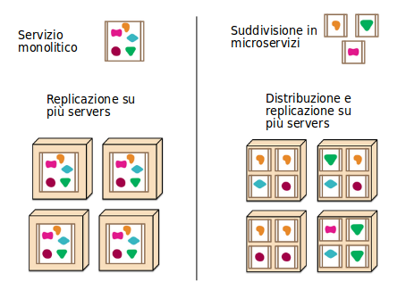

# Microservizi

Un microservizio è un altro termine molto di moda, e descrive una situazione di organizzazione dei servizi complessi molto attraente.

Un microservizio è uno stile architettonico:
* sviluppare un singolo applicativo come serie di piccoli servizi
    * ciascuno come processo separato
    * in comunicazione tra loro, spesso con API basate su HTTP: **REST** - _Representational State Transfer_), o tramite **RPC** - _Remote Procedure Calls_.
    * deploy indipendente anche su hardware diversi

La modularizzazione dei programmi è presente da lungo periodo, ma, attenzione alla differenza:

* **librerie** - moduli riutilizzabili linkati nello spazio di indirizzamento di un singolo processo monolitico
* **servizi** - componenti fuori dallo spazio di indirizzamento del processo client che li usa

I servizi sono:
* più lenti delle librerie
* mantenibili e sostituibili individualmente
* sviluppabili da team separate

I servizi dipendono da una precisa definizione delle **Interfacce** che, una volta progettate e implementate, sono difficilmente cambiabili.

I servizi sono oberati da una serie di paroloni positivi:
* **componentizzazione**
* **vicinanza ai problemi _business_**
* **_prodotti_ non _progetti_**
* **approccio _bottom-up_**
* **_sevizi intelligenti_ e _canali di comunicazione stupidi_**
* **amministrazione decentralizzata**
* **gestione dati decentralizzata**
* **automazione di infrastruttura**
* **progettati per la tolleranza alfallimento**
* **design evolutivo**

Non tutti i programmatori moderni sono convinti della bontà del modello dei servizi in luogo di quello delle librerie.
