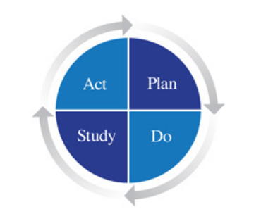

# Docker e il Devops

DevOps è un nuovo modo di pensare le organizzazioni, allo scopo di migliorare la qualità e la velocità di introduzione di soluzioni innovative.

DevOps è una riorganizzazione interna che armonizza le capacità e i requisiti dei settori **Development** e **Operations** e impedisce incomprensioni e scaricamento di responsabilità:

DevOps è un utilizzo di tecnologie appropriate, tra cui Docker.

DevOps è basato su tre principi - **The Three Ways of DevOps**:

#### 1. Systems Thinking

E' importante considerare l'intero sistema come un unico flusso di valori che deve essere ottimizzato, non ottimizzare i singoli componenti.

Definito nel _Lean Manufactory_ come **Lead Time**, è il _pipeline_ che conduce dalle idee al fatturare il prodotto finito.

Occorreridurre i colli di bottiglia del _pipeline_.

#### 2. Amplify Feedback Loops

Un feedback continuativo dalle attività a valle del _pipeline_ a quelle a monte permette la scoperta e correzione veloce di difetti, bachi e imperfezioni, prima che diventino intrattabili.

#### 3. Continuous Learning

**Kaizen** - cultura di sperimentazione continua, apprendimento continuo e propagazione delle esperienze in tutta l'organizzazione.

Anche basato su una modifica al **Ciclo di Deming** (l'originale era Plan-Do-Check-Act).

La sperimentazione e apprendimento, anche dagli errori, è sempre alla luce di una **Visione** dell'obiettivo finale da raggiungere.
