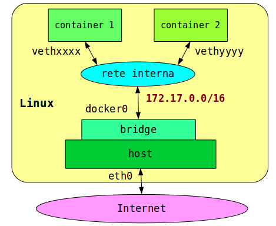

## Gestione della Rete

Listare le reti:
```
docker network ls

NETWORK ID          NAME                DRIVER              SCOPE
554b4e606c27        bridge              bridge              local
34a7f0beecf2        host                host                local
c27ab4d47bc2        none                null                local
```

### Il driver `bridge`

E' il default: genera una rete interna con un o stack privato e un indirizzo privato per il container.

Esempio:
##### `docker run -ti --name=bridgenet --net=bridge alpine sh`

```
/ # ifconfig
eth0      Link encap:Ethernet  HWaddr 02:42:AC:11:00:02  
          inet addr:172.17.0.2  Bcast:0.0.0.0  Mask:255.255.0.0
          inet6 addr: fe80::42:acff:fe11:2/64 Scope:Link
          UP BROADCAST RUNNING MULTICAST  MTU:1500  Metric:1
          RX packets:22 errors:0 dropped:0 overruns:0 frame:0
          TX packets:8 errors:0 dropped:0 overruns:0 carrier:0
          collisions:0 txqueuelen:0 
          RX bytes:3308 (3.2 KiB)  TX bytes:648 (648.0 B)

lo        Link encap:Local Loopback  
          inet addr:127.0.0.1  Mask:255.0.0.0
          inet6 addr: ::1/128 Scope:Host
          UP LOOPBACK RUNNING  MTU:65536  Metric:1
          RX packets:0 errors:0 dropped:0 overruns:0 frame:0
          TX packets:0 errors:0 dropped:0 overruns:0 carrier:0
          collisions:0 txqueuelen:1 
          RX bytes:0 (0.0 B)  TX bytes:0 (0.0 B)

/ #
```

Viene inoltre modificata la tabella `nat` di `iptables` con il `MASQUERADING` della rete interne generata. Questo permette al container di accedere ad Internet tramite la macchina host.

```
sudo iptables -t nat -L -n

Chain PREROUTING (policy ACCEPT)
target     prot opt source               destination         
DOCKER     all  --  0.0.0.0/0            0.0.0.0/0            ADDRTYPE match dst-type LOCAL

Chain INPUT (policy ACCEPT)
target     prot opt source               destination         

Chain OUTPUT (policy ACCEPT)
target     prot opt source               destination         
DOCKER     all  --  0.0.0.0/0           !127.0.0.0/8          ADDRTYPE match dst-type LOCAL

Chain POSTROUTING (policy ACCEPT)
target     prot opt source               destination         
MASQUERADE  all  --  172.17.0.0/16        0.0.0.0/0           

Chain DOCKER (2 references)
target     prot opt source               destination         
RETURN     all  --  0.0.0.0/0            0.0.0.0/0
```

### Il driver `host`

Il contenitore condivide lo stack di rete dello host. Tutte le interfacce di rete dello host sono visibili anche al container.

Esempio:
##### `docker run -ti --name=hostnet --net=host alpine sh`

```
br-c902ab4a1cca Link encap:Ethernet  HWaddr 02:42:BB:80:8A:35  
          inet addr:172.18.0.1  Bcast:0.0.0.0  Mask:255.255.0.0
...

docker0   Link encap:Ethernet  HWaddr 02:42:DB:92:EA:4F  
          inet addr:172.17.0.1  Bcast:0.0.0.0  Mask:255.255.0.0
...

enp2s0f0  Link encap:Ethernet  HWaddr 20:89:84:4F:75:16  
          UP BROADCAST MULTICAST  MTU:1500  Metric:1
...

lo        Link encap:Local Loopback  
          inet addr:127.0.0.1  Mask:255.0.0.0
...

vethbfd4d31 Link encap:Ethernet  HWaddr DE:91:B4:A7:F9:99  
          inet6 addr: fe80::dc91:b4ff:fea7:f999/64 Scope:Link
...

wlp3s0    Link encap:Ethernet  HWaddr 80:9B:20:2E:88:90  
          inet addr:192.168.0.10  Bcast:192.168.255.255  Mask:255.255.0.0
...

```
I programmi di rete dello host e del contenitore devono usare porte diverse. Diventa molto complicato gestire più contenitori con il driver `host`.

### Il driver `none`

Il contenitore non ha indirizzi esterni. Lo stack di rete è limitato all'interfaccia di loopback.

Esempio:
##### `docker run -ti --name=nonet --net=none alpine sh`

```
/ # ifconfig
lo        Link encap:Local Loopback  
          inet addr:127.0.0.1  Mask:255.0.0.0
          inet6 addr: ::1/128 Scope:Host
          UP LOOPBACK RUNNING  MTU:65536  Metric:1
          RX packets:0 errors:0 dropped:0 overruns:0 frame:0
          TX packets:0 errors:0 dropped:0 overruns:0 carrier:0
          collisions:0 txqueuelen:1 
          RX bytes:0 (0.0 B)  TX bytes:0 (0.0 B)

/ # 
```

### Due containers sulla rete di default



##### `docker run -ti --name=one alpine sh`
```
/ # ifconfig
eth0      Link encap:Ethernet  HWaddr 02:42:AC:11:00:02  
          inet addr:172.17.0.2  Bcast:0.0.0.0  Mask:255.255.0.0
...
/ #
```
`Ctrl-P Ctrl-Q` per uscire senza terminare il container.

##### `docker run -ti --name=one alpine sh`
```
/ # ifconfig
eth0      Link encap:Ethernet  HWaddr 02:42:AC:11:00:03  
          inet addr:172.17.0.3  Bcast:0.0.0.0  Mask:255.255.0.
...
/ # ping 172.17.0.2
PING 172.17.0.2 (172.17.0.2): 56 data bytes
64 bytes from 172.17.0.2: seq=0 ttl=64 time=0.197 ms
64 bytes from 172.17.0.2: seq=1 ttl=64 time=0.159 ms
64 bytes from 172.17.0.2: seq=2 ttl=64 time=0.177 ms
^C
--- 172.17.0.2 ping statistics ---
3 packets transmitted, 3 packets received, 0% packet loss
round-trip min/avg/max = 0.159/0.177/0.197 ms

/ # ping one
ping: bad address 'one'
/ # 
```
Ogni container vede gli altri, ma non vi è nessun servizio di risoluzione nomi-indirizzi.
