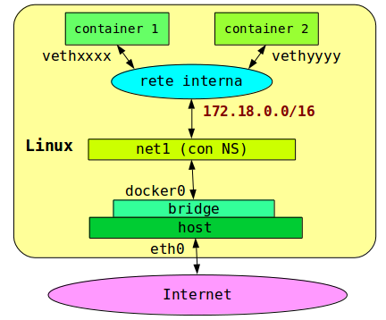

## Reti con Nome

##### `docker network create net1`

Crea una rete di nome `net1`.



Una rete con nome è essa stessa un container: Si può visualizzarne le proprietà:
```
docker network inspect net1 
[
    {
        "Name": "net1",
        "Id": "9aa4d0778dde156db22c4f88ecc07f6748adce397edea2a8dc8bf4de88b487e5",
        "Created": "2017-06-04T23:50:23.214967483+02:00",
        "Scope": "local",
        "Driver": "bridge",
        "EnableIPv6": false,
        "IPAM": {
            "Driver": "default",
            "Options": {},
            "Config": [
                {
                    "Subnet": "172.18.0.0/16",
                    "Gateway": "172.18.0.1"
                }
            ]
        },
        "Internal": false,
        "Attachable": false,
        "Containers": {},
        "Options": {},
        "Labels": {}
    }
]
```
E' in formato JSON.


##### `docker run -ti --net=net1 --name one alpine sh`
```
Ctrl-P Ctrl-Q
```
##### `docker run -ti --net=net1 --name two alpine sh`
```
/ # ping one
PING one (172.18.0.2): 56 data bytes
64 bytes from 172.18.0.2: seq=0 ttl=64 time=0.162 ms
64 bytes from 172.18.0.2: seq=1 ttl=64 time=0.155 ms
^C
--- one ping statistics ---
2 packets transmitted, 2 packets received, 0% packet loss
round-trip min/avg/max = 0.155/0.158/0.162 ms
/ #
```
C'è risoluzione nomi-indirizzi, servizio offerto da `net1`.

Il nome di un container (hostname) è:
* quello assegnato dall'opzione `--name`
    * scelta più opportuna
* quello di fantasia assegnato di default
* lo ID del container

